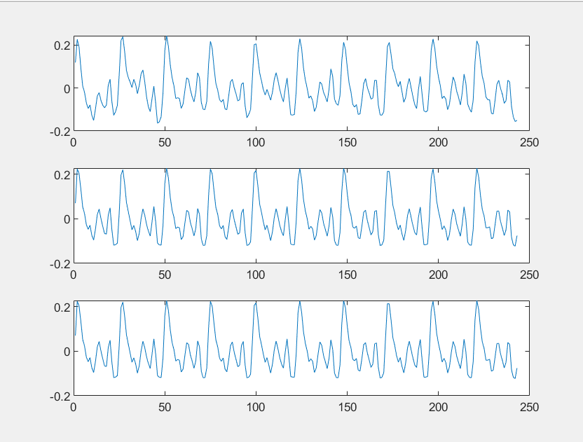

## 音乐合成综合实验
##### 代码列表（代码附在最后）
```
|----简单的合成音乐
  |--project1_1.m
  |--project1_2.m--baoluo.m
  |--project1_3.m--baoluo.m
  |--project1_4.m--baoluo.m--xiebo.m
  |--project1_5.m--baoluo.m--xiebo.m
  |--my_wavread.m
  |--project2_2.m
  |--project2_4.m--analysis.m
  |--baoluoplus.m--xieboplus.m
  |--trial_again.m
  |--project3_2.m
```
#### 简单的合成音乐
##### 1、根据东方红第一小节的简谱和十二平均律计算出该小节中各个乐音的频率
- 代码`project1_1.m`
一步一步的分别用正弦信号表示乐音，分别用默认采样率和8K的采样率进行播放(区别不大)，但是相临的乐音之间会有啪的杂音(相位不连续产生了高频分量)导致虽然有东方红的感觉但是效果一般  

##### 2、使用包络修正乐音
- 代码`project1_2.m`
- 代码`baoluo.m`  
`x*exp(-kx/rhythm)`的修正方式使得乐音波形更加圆润，效果更好。 这里的x相当于采样时间t，rhythm则控制每个音符的长度。 
在前0.3x用`x*exp(-kx/rhythm)`的修正方式进行包络，一步达成冲激和衰减两个操作；之后为保证乐音的连续性将乐音持续0.5x，在最后0.2x的时间内用直线将乐音幅度将为0。同时根据不同乐音的持续时间，乐音的消失速率也不同，使得乐音的变化更加平滑。
总体来说，是根据四段直线修正的思路，但是冲激和衰减用`x*exp(-kx/rhythm)`的修正方式一步到位，最后消失采用直线的修正方式。
包络线；

乐音包络结果：

##### 3、用最简单的方法将（2）中音乐上升或者降低一个八度（音乐的播放时间可以变化）。再难一些，用resample函数（也可以用interp和decimate函数）将上述音乐提高半个音阶 
- 代码`project1_3.m`和`baoluo.m`
- 直接将采样频率改为4000或者16000即降低或者上升一个八度，同时会改变播放速度。
- resample (重采样)$\rightarrow$由于K=$2^{1/12}$=1.05946309
所以直接resample(R,1000,1059)即可。

##### 试着在2的音乐中增加一些谐波分量
- 代码`project1_4.m`和`baoluo.m`和`xiebo.m`
- 先加入谐波再进行包络修正，最终结果声音更显清脆，类似风琴的乐器发音

放大可以看出加谐波并包络修正之后的效果，可能出现了部分毛刺。

##### 选择较为简单明了的晴天第一句进行合成
- 代码`project1_5.m`and`baoluo.m`and`xiebo.m`

晴天是一小节4拍，一拍为四分之一音符持续时间，一分钟有67拍一拍约为0.45s
直接加了二次和三次谐波。和原曲比较音色的差距比较大。

#### 用傅里叶级数分析音乐

##### 先用wavread函数载入中国高校电工电子课程网上的`fmt.wav`文件，播放出来效果如何？是否比刚才的合成音乐真实多了？
- 代码`my_wavread.m`//matlab中wavread函数好像被删掉了
用`audioread`函数获得的样本数据以及样本数据的采样率，然后用`sound`函数播放。
效果真实多了。

##### 你知道待处理的`wave2proc`是如何从真实值`realwave`中得到的吗？
- 代码project2_2.m
先比较两者的区别：

观察两者波形后可以明显发现`wave2proc`的波形几乎是严格重复10个周期,而`realwave`波形的10个周期略有区别。同时,非线性谐波和噪声是随机的，故可以将`realwave`十个“周期”的波形取平均再重复十次得到去噪波形。
进一步发现 realwave 采样点数目为 243 不是十的倍数，故先用 resample 函数将波形用十倍采样点采样。将重采样的波形分成十段叠加，重复十次，之后再用 resample 函数将波形用
十分之一采样点采样。
之后再恢复10个周期波形进行对比。

可以计算`wavedone`和`realwave`之间的绝对误差：

可以看出，误差几乎可以忽略不计。

##### 这段音乐的基频是多少？是哪个音调？请用傅里叶级数或变换的方式分析他的谐波分量分别是什么？
- 代码`project2_3.m`
- 估算基频大概在328.77Hz
按照书上的引导，将时域数据量增加，之后求傅里叶变换。
直接使用fft和N点fft的结果相似
- fft

- N-fft

个人认为直接使用fft可能更符合实际
- 谐波

```
| 1  | 2  |  3 |  4 | 5  | 6  | 7  |
|0.54415|0.079292|0.0521705|0.0598518|0.00284736|0.00597783|0.0195305|
```
##### 自动分析音调和节拍
- 代码`project2_4.m`
- `analysis.m`
- 特意新建一个文档进行解释
将原`.wav`文件依据时间进行剪辑，用数组分别存储单个音调的数据输入`analysis()`函数进行分析得到结果。
结果y1-频率；y2-幅值，打印在pdf文件中。
#### 基于傅里叶级数的合成音乐
##### 用6.2.2节计算出来的傅里叶级数再完成6.2.1
- 由于谐波有8项，一次手动写出极其复杂，故重新设计`xieboplus.m`and`baoluoplus.m`以方便此次实验。
- 代码`trial_again.m`
- 观察guitar的包络形式更换了包络修正方式（指数衰减）

对比原来的修正方式可以明显听出拨弦音，但是对比fmt.wav显得音色单一，效果并不如想象的那么好。
但是对比不加谐波，感觉又比较像吉他音。

##### 通过6.2.2(4)提取的每个音调的傅里叶级数，来演奏东方红。
- 通过对比来确定东方红各个频率在guitar发音中对应的音调
- 代码`project3_2.m`
- 293.66
谐波：
`294.853963838665` `588.317107093185` `881.780250347705` `0` `0`
幅值：
`0.0254259532813012` `0.360028422017994` `0.165951206308385` `0` `0`
- 349.23
谐波：
`350.649350649351` `701.298701298701` `1051.94805194805` `0` `1748.91774891775`
幅值：
`0.0397468457542857` `0.247218307796929` `0.148830449585512` `0` `0.0519819341979845`
- 392
谐波：找一个最接近的
`391.941391941392`	`783.882783882784`	`1175.82417582418``0`	`0`
幅值：
`0.0390880836827899`	`0.112976558669937`	`0.0761956169669993`	`0`	`0`
- 523.25
谐波：用一半来近似
`261.632544536028`	`523.265089072055`	`782.770539750067`	`1046.53017814411`	`1306.03562882212`
幅值：
`0.0426421037555196`	`0.361188311239684`	`0.0709486593009144`	`0.0578955264103535`	`0.0752435861321976`
- 587.33
谐波：用一半来近似
`294.853963838665`	`588.317107093185`	`881.780250347705`	`0`	`0`
幅值：
`0.0254259532813012`	`0.360028422017994`	`0.165951206308385`	`0`	`0`
结果：拨弦感更为强烈，但是听起来像是一个初学者一个一个的拨弦进行弹奏，感觉十分呆愣，但是至少像是一个吉他发出来的音了。
##### gui
现在只要你掌握了某乐器足够多的演奏资料，就可以合成出该乐器演奏的任何音 乐，在学完本书后面内容之后，试着做一个图形界面把上述功能封装起来。
`music_inter_face.m`
`sound_play.m`
使用F大调，共14个音调(音调可以取1-14)另外有C大调备选(音调取1-8)

